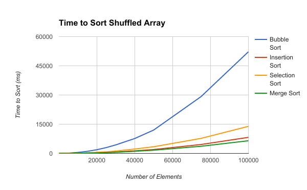
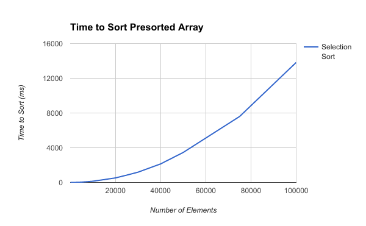
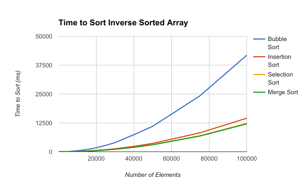

# Reflections on sorting

## O(n2) sorts
Of the three standard intro-to-cs sorting algorithms (bubble, selection, insertion), I find that insertion sort stands out as especially difficult to correctly implement.

I think this can be pretty easily be attributed to the fact that bubble sort and selection sort can be pretty easily translated from the high level concept to C. Swapping is the one gotcha, but it doesn't significantly affect the implementation.

Insertion sort, however, requires that extra bit of effort: manually making space for your insertion. Once the insertion position is found, a second iteration is needed to push everything out of the way to make room. Alternatively, you can work from the end of the sorted portion of the array down and push things out of the way as you go, but this makes it tempting to allow your indexes to go negative or add extra additions and subtractions on the index. The first is dangerous, the second is error prone (and also possibly dangerous). I think the thought needed makes the single iteration version of insertion sort particularly useful for learning - Even in something as simple as sorting, it's easy to shoot yourself in the foot.

# Results

## Random Arrays

As expected, bubble sort, insertion sort, and selection sort all show an n2 curve. Bubble sort being significantly more expensive because bubble sort has to perform p1*(n-i) swaps to sort each element where n is the length of the array, i is the number of elements that have been already sorted, and p1 is some likelihood of requiring a swap. 

Surprisingly mergesort, which should be nlog(n) looks awfully similar to insertion sort. This is explained by my poor merge implementation. Since I wanted to do an in-place merge, the merge step degrades to a slighly optimized insertion sort.

Also somewhat surprising is that insertion sort, which requires shifting an array to make space for insertion, performs worse than selection sort, which only needs one swap to sort each element. It's worth noting, however, that selection sort must check all of the unsorted array to find the next element. Insertion sort only needs to consider the sorted section of the array until it finds a smaller element, at which point it can short circuit. Only in the pathological case of a reverse sorted array (which we'll consider later) would insertion sort need to consider the entire sorted portion of the array. Therefore, when sorting a random array, insertion sort scans less of the array on every iteration than selection sort would. Additionally, since this insertion sort implementation only needs to move any given element by 1, all memory accesses exist in at most 2 cache lines, which means the shifting operation should not cause more main memory accesses than just scanning the list would.

Quick Sort is so fast that it is not pictured. At 100,000 elements, it was still only ~15ms.

## Presorted arrays

On presorted arrays, nearly every sort takes less time than my resolution - with the notable exception of selection sort which is nearly unaffected. This can be explained pretty easy:
Bubble Sort - simply iterates through the array, sees that no element needs to be stopped, and terminates. An O(n) operation.
Insertion Sort - looks for the insertion point, but breaks after 1 comparison having already found the insertion point - the current position
Merge Sort - As mentioned, my merge sort implementation is nearly identical to insertion sort
Quick Sort - Works exactly the same, but was so fast in general that it doesn't fit on this graph.
Selection Sort - In order to select the correct element, selection sort still needs to scan from i to the end of the array, which means it retains it's O(n2) performance

## Inverse Sorted Arrays

Probably the hardest thing for me to describe in these results is the fact that bubble sort is more efficient at sorting a reverse array than a random array. I would have expected this to be the worst performance as it requires shifting the entire array down one element to sort each element. I really don't have an explanation for this one. Possibly some direct comparisons between a random and reverse sorted array would be good to make sure there wasn't a configuration difference.

As alluded to in the random array section, selection sort now performs better than insertion sort. This is expected as now each requires a full scan to find the next element/insertion point, respectively. The difference is that insertion sort requires a write during the scan that selection sort does not.

Merge sort remains a slightly optimized insertion sort and so retains it's slightly-better-than-insertion-sort performance.

Finally, quicksort still behaves with the same performance as before
